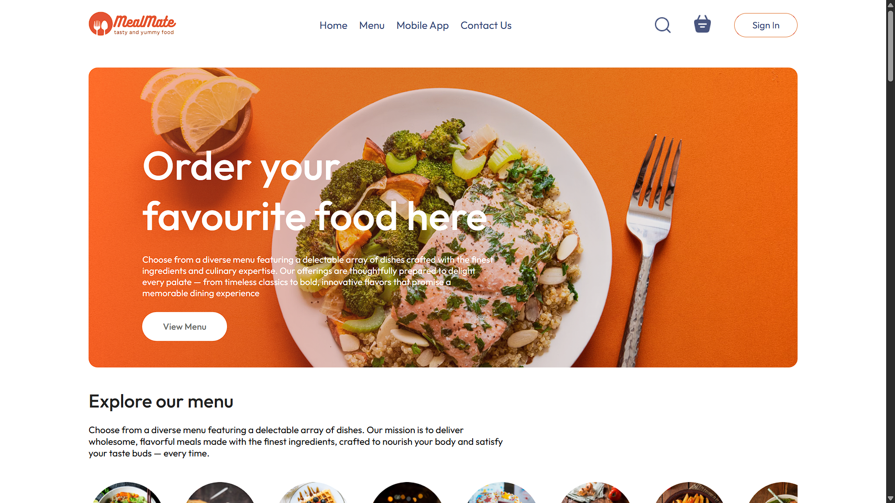
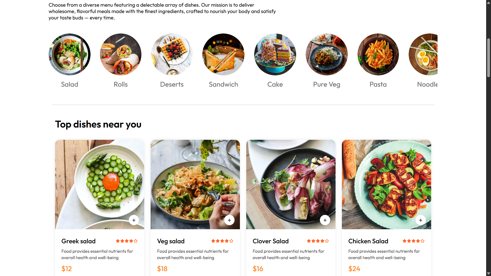
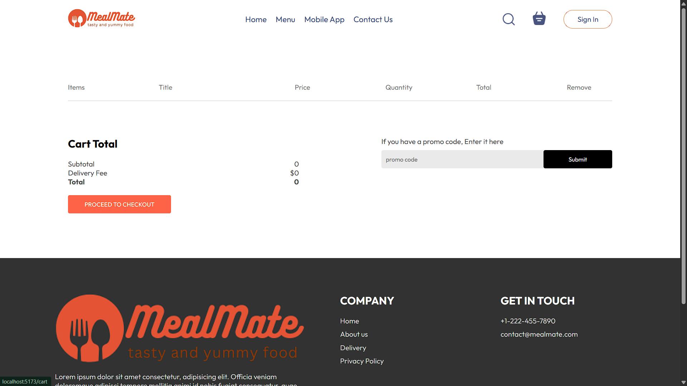
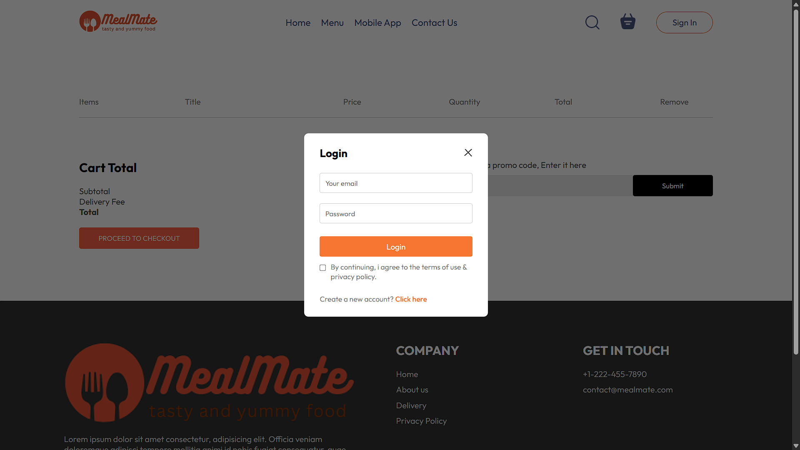
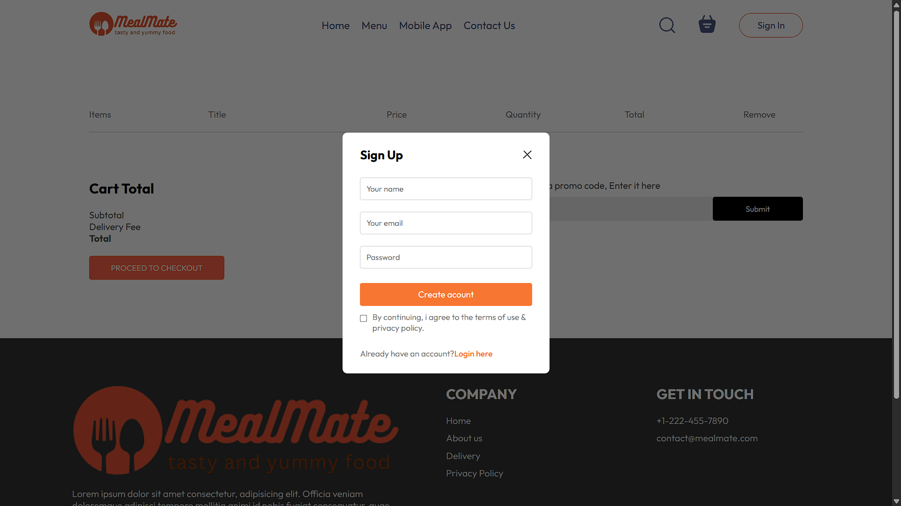

# MealMate 🍽️

MealMate is a modern web application that helps users discover, plan, and manage meals efficiently.  
Built with React and Vite, it focuses on fast performance, clean UI, and a scalable frontend architecture.

---

## Live Demo
🔗 https://mealmate-app.netlify.app

---

## Features
- Browse and explore meals with a clean, responsive UI
- Fast client-side rendering using Vite
- Modular and reusable React components
- Scalable project structure for future backend integration
- Mobile-friendly and accessible design

---

## Screenshots







---

## Tech Stack
- **Frontend:** React, Vite
- **Build Tool:** Vite
- **Version Control:** Git, GitHub
- **Deployment:** Netlify

---

## Project Structure
```
client/
├── public/            # Static assets (images, icons, etc.)
├── src/               # Application source code
│   ├── components/    # Reusable UI components
│   ├── pages/         # Page-level components
│   └── main.jsx       # Application entry point
├── index.html         # Root HTML template
├── package.json       # Project dependencies and scripts
├── vite.config.js     # Vite configuration
```

---

## Installation & Setup

1. Clone the repository:
   ```bash
   git clone https://github.com/itsharsh56/mealmate.git
   ```
- cd mealmate/client
- npm install
- npm run dev
- http://localhost:5173

---

## Future Enhancements
- User authentication and profiles
- Meal bookmarking and favorites
- Backend integration with Node.js and MongoDB
- Personalized meal recommendations

---

